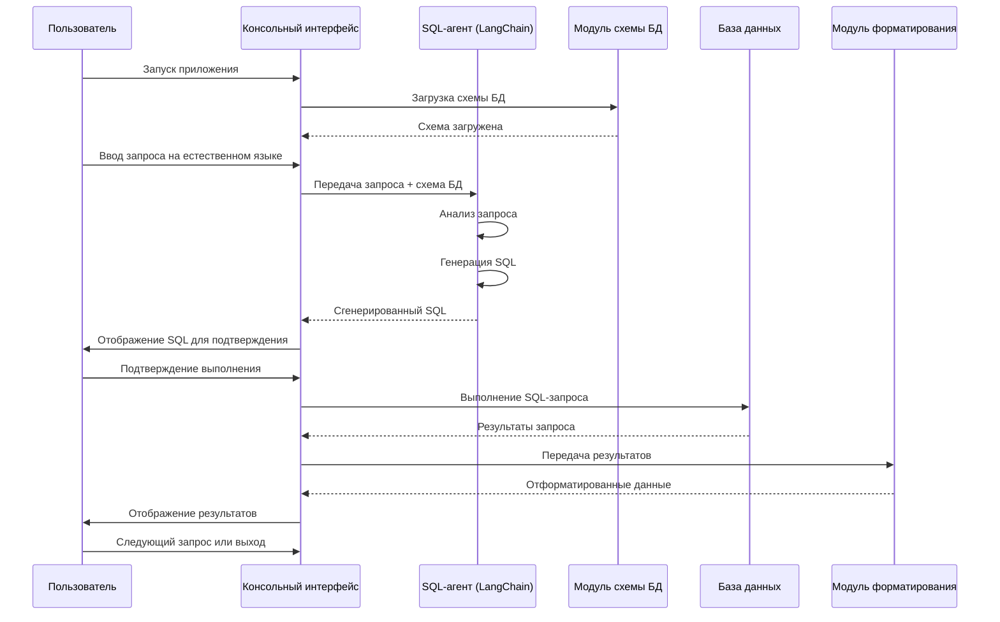

# HomoSQL Agent

Интеллектуальный ассистент для взаимодействия с SQL-базами данных через естественный язык, который автоматически преобразует пользовательские запросы в SQL-запросы и возвращает результаты в понятном формате.

# Назначение проекта

Система предназначена для автоматизации процесса извлечения данных из реляционных баз данных с помощью естественного языка. Проект решает задачу democratization of data — делает данные доступными для пользователей без технических навыков программирования на SQL.

## User-story (минимум 3 сценария)

### Сценарий 1: Бизнес-аналитик запрашивает отчёт о продажах
**Как** бизнес-аналитик,  
**Я хочу** получить отчёт о продажах за последний квартал по регионам,  
**Чтобы** принять решение о распределении маркетингового бюджета.

**Шаги:**
1. Пользователь запускает приложение
2. Вводит запрос: "Покажи продажи за последний квартал по регионам"
3. Система анализирует схему базы данных
4. Генерирует SQL-запрос: `SELECT region, SUM(amount) FROM sales WHERE date >= DATE('now', '-3 months') GROUP BY region`
5. Выполняет запрос к базе данных
6. Возвращает результаты в виде таблицы

### Сценарий 2: Менеджер по персоналу ищет информацию о сотрудниках
**Как** менеджер по персоналу,  
**Я хочу** найти всех сотрудников с зарплатой выше среднего по отделу,  
**Чтобы** провести анализ компенсационного пакета.

**Шаги:**
1. Пользователь вводит запрос: "Найди сотрудников с зарплатой выше среднего по их отделу"
2. Система определяет необходимость использования подзапроса
3. Генерирует SQL-запрос с подзапросом для расчёта средней зарплаты
4. Выполняет запрос и возвращает список сотрудников

### Сценарий 3: Руководитель отдела хочет сравнить показатели
**Как** руководитель отдела,  
**Я хочу** сравнить показатели текущего месяца с предыдущим,  
**Чтобы** оценить динамику изменений.

**Шаги:**
1. Пользователь вводит запрос: "Сравни продажи этого месяца с прошлым"
2. Система использует контекст предыдущих запросов
3. Генерирует SQL-запрос с агрегацией по периодам
4. Возвращает сравнительную таблицу с показателями

## Функциональные требования

### FR-1: Подключение к базе данных
- Система должна поддерживать подключение к PostgreSQL
- Система должна поддерживать подключение к SQLite
- Система должна автоматически читать схему базы данных (таблицы, колонки, типы данных)
- Система должна определять внешние ключи и связи между таблицами

### FR-2: Обработка естественного языка
- Система должна понимать вопросы на русском языке
- Система должна понимать вопросы на английском языке
- Система должна генерировать корректные SQL-запросы (SELECT, JOIN, WHERE, GROUP BY, ORDER BY)
- Система должна поддерживать агрегатные функции (COUNT, SUM, AVG, MIN, MAX)
- Система должна поддерживать фильтрацию по датам и числовым значениям
- Система должна сохранять контекст предыдущих запросов

### FR-3: Выполнение запросов
- Система должна безопасно выполнять SQL-запросы
- Система должна ограничивать количество возвращаемых строк (по умолчанию 100)
- Система должна обрабатывать ошибки базы данных
- Система должна предотвращать выполнение опасных операций (DROP, DELETE, UPDATE, INSERT)

### FR-4: Форматирование результатов
- Система должна представлять результаты в виде таблицы
- Система должна поддерживать форматирование в JSON
- Система должна предоставлять естественно-языковое описание результатов

### FR-5: Интерфейс взаимодействия
- Система должна предоставлять консольный интерфейс
- Система должна поддерживать интерактивный режим диалога
- Система должна отображать сгенерированный SQL-запрос для проверки

## План реализации проекта (поэтапно)

### Этап 1: Фундамент (текущий)
- [x] Создание README.md с описанием проекта
- [x] Создание технической документации
- [ ] Инициализация структуры проекта
- [ ] Настройка виртуального окружения и зависимостей

### Этап 2: Работа с базой данных
- [ ] Реализация модуля подключения к БД (connection.py)
- [ ] Реализация модуля чтения схемы БД (schema.py)
- [ ] Создание примера базы данных для тестирования
- [ ] Написание unit-тестов для модуля БД

### Этап 3: Генерация SQL с LangChain/LangGraph
- [ ] Настройка LangChain для работы с LLM
- [ ] Реализация агента генерации SQL (sql_generator.py)
- [ ] Создание промптов для генерации SQL
- [ ] Интеграция со схемой базы данных
- [ ] Тестирование генерации SQL на различных запросах

### Этап 4: Выполнение и форматирование
- [ ] Реализация модуля выполнения запросов (query_executor.py)
- [ ] Реализация модуля форматирования результатов (formatters.py)
- [ ] Добавление валидации и безопасности SQL-запросов
- [ ] Тестирование выполнения запросов

### Этап 5: Консольный интерфейс
- [ ] Реализация основного скрипта (main.py)
- [ ] Создание интерактивного цикла диалога
- [ ] Добавление обработки ошибок и логирования
- [ ] Интеграция всех модулей

### Этап 6: Тестирование и документирование
- [ ] Написание интеграционных тестов
- [ ] Создание примеров использования
- [ ] Обновление документации
- [ ] Подготовка к демонстрации MVP

# Портрет пользователя

### Основные пользователи:
1. **Бизнес-аналитик** — работает с данными ежедневно, имеет базовые знания SQL, но хочет ускорить работу
2. **Менеджер** — нуждается в быстром доступе к данным для принятия решений, не знает SQL
3. **Руководитель отдела** — требует отчёты и аналитику, предпочитает естественный язык

### Уровень технической экспертизы:
- От начинающего до среднего
- Знакомство с концепциями баз данных на базовом уровне
- Отсутствие опыта написания SQL-запросов

## Use-case (текстовое описание)

### Основной сценарий использования: Получение данных через естественный язык

**Предусловия:**
- Пользователь имеет доступ к системе
- База данных подключена и доступна
- Схема базы данных загружена

**Основной поток:**
1. Пользователь запускает приложение через консоль
2. Система приветствует пользователя и предлагает ввести запрос
3. Пользователь вводит вопрос на естественном языке
4. Система анализирует запрос и определяет намерение
5. Система генерирует SQL-запрос на основе схемы БД
6. Система отображает сгенерированный SQL-запрос для подтверждения
7. Пользователь подтверждает выполнение запроса
8. Система выполняет запрос к базе данных
9. Система форматирует результаты и отображает их пользователю
10. Система предлагает задать следующий вопрос

**Альтернативные потоки:**
- **A1:** Сгенерированный SQL-запрос некорректен
  - Пользователь отклоняет запрос
  - Система предлагает переформулировать вопрос
  - Возврат к шагу 3

- **A2:** Ошибка выполнения запроса
  - Система перехватывает ошибку
  - Отображает понятное сообщение об ошибке
  - Предлагает попробовать другой запрос
  - Возврат к шагу 3

- **A3:** Результаты слишком большие
  - Система ограничивает вывод первыми N строками
  - Предлагает уточнить запрос или экспортировать все данные
  - Продолжение с шага 9

**Постусловия:**
- Пользователь получил запрошенные данные
- Запрос сохранён в истории (опционально)

## Диаграмма последовательности

# Нефункциональные требования

## Матрица требований (Таблица: Требование | Приоритет | Критерий приемки)

| Требование | Приоритет | Критерий приемки |
|------------|-----------|------------------|
| **Производительность** | | |
| Время генерации SQL-запроса | Высокий | Не более 5 секунд для типичных запросов |
| Время выполнения запроса к БД | Высокий | Не более 10 секунд для запросов до 1000 строк |
| Время отклика системы | Средний | Не более 15 секунд от ввода до результата |
| **Надёжность** | | |
| Обработка ошибок БД | Высокий | 100% ошибок перехватываются и отображаются пользователю |
| Валидация SQL-запросов | Высокий | Запрещены все операции модификации данных (DROP, DELETE, UPDATE, INSERT) |
| Лимитирование результатов | Высокий | По умолчанию не более 100 строк, настраивается |
| **Безопасность** | | |
| Защита от SQL-инъекций | Критический | Использование параметризованных запросов |
| Хранение учётных данных | Высокий | Учётные данные хранятся в .env файле, не коммитятся в репозиторий |
| Логирование операций | Средний | Все запросы и результаты логируются |
| **Юзабилити** | | |
| Понятность сообщений об ошибках | Высокий | Сообщения на русском языке, содержат рекомендации |
| Отображение SQL-запроса | Средний | Пользователь видит сгенерированный SQL перед выполнением |
| Поддержка русского языка | Высокий | Система корректно обрабатывает запросы на русском |
| **Масштабируемость** | | |
| Поддержка различных БД | Средний | PostgreSQL и SQLite в MVP, возможность расширения |
| Модульная архитектура | Средний | Каждый компонент может быть заменён независимо |
| **Совместимость** | | |
| Python версия | Высокий | Python 3.10+ |
| Операционные системы | Средний | Linux, macOS, Windows |
| **Тестируемость** | | |
| Unit-тесты | Высокий | Покрытие не менее 80% для критических модулей |
| Интеграционные тесты | Средний | Основные сценарии протестированы |
| **Документация** | | |
| README | Высокий | Содержит инструкции по установке и использованию |
| API документация | Средний | Описание основных модулей и функций |
| Примеры использования | Средний | Минимум 5 примеров запросов |
